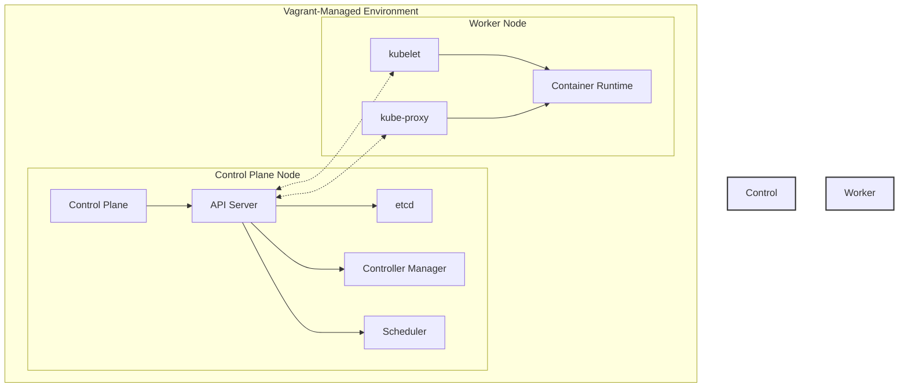

# Vagrant Kubernetes Cluster

[](https://opensource.org/licenses/MIT)
[](https://www.vagrantup.com/)
[](https://kubernetes.io/)
[](https://ubuntu.com/)

This project sets up a local Kubernetes cluster using Vagrant and VirtualBox. It creates two Ubuntu 22.04 virtual machines: one control plane node and one worker node with automatic installation of Docker, Kubernetes components, and necessary configurations.

## Architecture



<p align="center">
  
</p>

## Prerequisites

- [VirtualBox](https://www.virtualbox.org/wiki/Downloads)
- [Vagrant](https://www.vagrantup.com/downloads)
- At least 4GB of RAM available
- At least 20GB of free disk space

## ✨ Features

<table>
<tr>
    <td align="center">🔄</td>
    <td>Automated VM provisioning with Ubuntu 22.04</td>
</tr>
<tr>
    <td align="center">🌐</td>
    <td>Pre-configured network settings</td>
</tr>
<tr>
    <td align="center">🐳</td>
    <td>Automatic installation of Docker and Kubernetes components</td>
</tr>
<tr>
    <td align="center">🚀</td>
    <td>Ready-to-use Kubernetes cluster setup</td>
</tr>
<tr>
    <td align="center">🔒</td>
    <td>Secure communication between nodes</td>
</tr>
<tr>
    <td align="center">🔍</td>
    <td>Easy monitoring and management</td>
</tr>
</table>

## 🖥 Cluster Configuration

> **Note about IP Addressing**: This configuration uses `192.168.63.11` and `192.168.63.12` for the control plane and worker nodes respectively. You can modify these IPs in the `Vagrantfile` to use any IP addresses from your router's IP range that are outside the DHCP scope. Make sure to choose IPs that won't conflict with other devices on your network.

<table>
<tr>
    <th width="50%">Control Plane Node</th>
    <th width="50%">Worker Node</th>
</tr>
<tr>
<td>

```yaml
IP: 192.168.63.11
Hostname: cplane
Memory: 2048MB
CPUs: 2
Role: Control Plane
```

</td>
<td>

```yaml
IP: 192.168.63.12
Hostname: worker
Memory: 2048MB
CPUs: 2
Role: Worker
```

</td>
</tr>
</table>

<p align="center">
  
</p>

## Quick Start

> **💡 Tip**: Before starting, you may want to adjust the IP addresses in the `Vagrantfile` if the default IPs (`192.168.63.11, 192.168.63.12`) conflict with your network setup. Edit the `private_network` IP settings in the Vagrantfile to match your network requirements.

1. Clone this repository:
```bash
git clone <repository-url>
cd vagrant
```

2. Start the cluster:
```bash
vagrant up
```

3. SSH into the control plane node:
```bash
vagrant ssh cplane
```

4. SSH into the worker node:
```bash
vagrant ssh worker
```

5. Stop the cluster:
```bash
vagrant halt
```

6. Destroy the cluster:
```bash
vagrant destroy
```

## 🛠 Components Installed

<details>
<summary>Click to expand installed components</summary>

| Component | Version | Description |
|-----------|---------|-------------|
| Docker CE | Latest | Container runtime engine |
| kubelet | Latest | Node agent |
| kubeadm | Latest | Cluster bootstrapping tool |
| kubectl | Latest | Command-line interface |
| containerd | Latest | Container runtime |
| Weave CNI | v2.8.1 | Container Network Interface |

</details>

## Cluster Setup Instructions

After the VMs are up and running, follow these steps to initialize your Kubernetes cluster:

### 1. On Control Plane Node

First, log into the control plane node:
```bash
vagrant ssh cplane
```

Pull required Kubernetes images:
```bash
sudo kubeadm config images pull
```

Initialize the cluster:
```bash
sudo kubeadm init --pod-network-cidr=10.201.0.0/16 --apiserver-advertise-address=192.168.63.11
```

### 2. Install CNI (Container Network Interface)

After the cluster initialization, install Weave CNI:
```bash
kubectl apply -f https://github.com/weaveworks/weave/releases/download/v2.8.1/weave-daemonset-k8s.yaml
```

### NOTE: Control Plane script 'cluster_init.sh' wraps steps 1. and 2.

For ease of use, a single script `cluster_init.sh` was created as a function of the "vagrant up" command for the control plane(s) that performs all of the above steps:
* k8s image pull
* kubeadm init
* local copy of "kube config"
* Weave CNI install

First, log into the control plane node:
```bash
vagrant ssh cplane
```

Run the Cluster Init Script:
```bash
./cluster_init.sh
```

### 3. Join Worker Node

Copy the `kubeadm join` command from the control plane node's initialization output and run it on the worker node with sudo privileges.

### NOTE: Control Plane script 'join_cmd.sh' shows the 'join' command

For ease of use, script `join_cmd.sh` was created to display the join command for use on worker nodes with this vagrant command:
```bash
vagrant ssh cplane -c "./join_cmd.sh"
```

### 4. Verify Cluster Status

After joining the worker node, verify the cluster status from the control plane node:

```bash
# Check node status
kubectl get nodes
```

Expected output (it may take a few minutes for the nodes to be ready):
```
NAME     STATUS   ROLES           AGE     VERSION
cplane   Ready    control-plane   5m32s   v1.30.x
worker   Ready    <none>          2m14s   v1.30.x
```

> **Note**: The nodes may show `NotReady` status initially as the CNI (Container Network Interface) is being configured. Please wait a few minutes for the status to change to `Ready`.

### Troubleshooting

If you encounter issues while joining the worker node, try these steps on both nodes:

1. Reset the cluster configuration:
```bash
sudo kubeadm reset
```

2. Perform system cleanup:
```bash
sudo swapoff -a
sudo systemctl restart kubelet
sudo iptables -F
sudo rm -rf /var/lib/cni/
sudo systemctl restart containerd
sudo systemctl daemon-reload
```

3. After cleanup, retry the cluster initialization on the cplane and join command on worker.

## Default Credentials

- Username: vagrant
- Password: vagrant

## License

This project is licensed under the MIT License - see the [LICENSE](LICENSE) file for details.

Copyright (c) 2024 Vagrant Kubernetes Cluster

## 📫 Support & Contribution

If you encounter any issues or need assistance:

[](https://github.com/yourusername/vagrant-kubernetes/issues/new)
[](https://github.com/yourusername/vagrant-kubernetes/pulls)

## 📝 License

This project is licensed under the MIT License - see the [LICENSE](LICENSE) file for details.

---

<div align="center">
Made with ❤️ for the Kubernetes community
</div>
